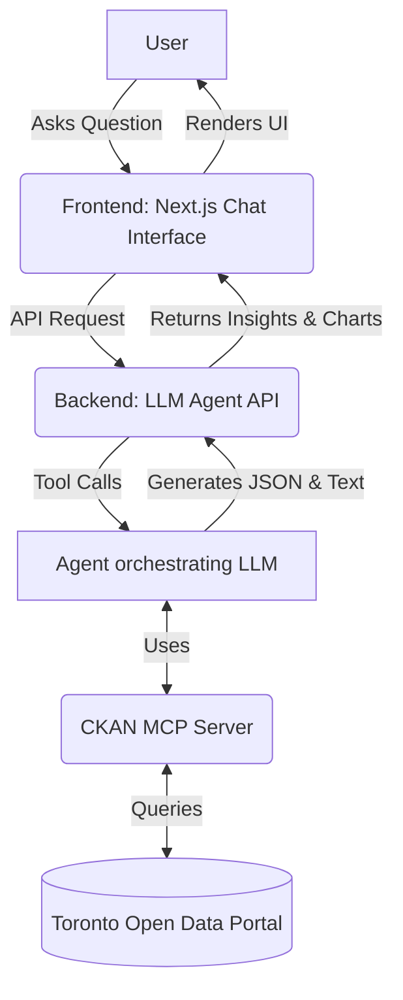

# Product Design: data-TO-value 🍁📈

**"What cannot be measured cannot be improved."** 

**data-TO-value** is a web application designed to bridge the gap between Toronto's vast open data and everyday residents. By combining an intuitive chat interface with the analytical horsepower of the CKAN MCP server, it empowers non-technical users to validate their assumptions, answer civic questions, and uncover insights with cold, hard facts.

---

## 1. Core Value Proposition

*   **Target Audience:** Everyday Toronto residents, journalists, local business owners, and community advocates who know how to use Google but lack data science skills.
*   **Unique Selling Proposition (USP):** Get your city-related questions answered instantly with strong data analysis, backed directly by the breadth of Toronto's Open Data.
*   **The "Why":** People have convictions and gut feelings about their city (e.g., "traffic is worse," "more noise complaints"). This tool replaces anecdote with analytical rigor, providing statistical summaries and visual proof.

## 2. Product Architecture

To make the MCP server available to the public, you need a web-friendly architecture. MCP is a protocol for AI agents, so we need to wrap it in a web application.

### The Tech Stack
*   **Frontend:** Next.js (React) or Vite. We'll use a modern UI library (like TailwindCSS or a component library) to create a premium, clean interface. 
*   **Backend/Agent Layer:** A Python backend (FastAPI) or Next.js server actions running an LLM (like Claude or GPT-4). This LLM will be equipped with your CKAN MCP server as its primary tool.
*   **Visualizations:** Recharts or Chart.js for rendering graphs dynamically based on the data the LLM retrieves.

## 3. User Experience (UX) & Features

### Phase 1: The Conversational Oracle (MVP)
*   **The Interface:** A clean, Google-like search bar that acts as a chat interface. 
*   **Starter Prompts:** Users might not know what to ask. Provide clickable chips:
    *   *"How many noise complaints were in Downtown vs. North York last month?"*
    *   *"Show me the 2024 operating budget for Parks & Rec."*
    *   *"Where are the new fire hydrants installed this year?"*
*   **Rich Responses:** When the LLM answers, it shouldn't just be text. The agent should return structured data so the frontend can render:
    *   **Text Summary:** The "TL;DR" (e.g., "Downtown had 40% more complaints").
    *   **Data Table:** A clean table showing the raw aggregates.
    *   **Dynamic Charts:** Bar charts, line graphs, or pie charts.

### Phase 2: The "Pulse of the City" (Future Phase)
*   **Curated Dashboards:** A homepage that tracks essential topics automatically (Budget, Housing, Safety).
*   **Data Changelogs:** The feature you mentioned—tracking *changes* in data. 
    *   *Implementation idea:* A scheduled background job that queries specific datasets weekly (using the MCP server), compares it to the previous week, and generates an automated news feed (e.g., "🚨 15 new fire hydrants were added to Toronto this week, mostly in Ward 10.").

## 4. How to build it? (Next Steps)

If we want to start building this, here is the immediate roadmap:

1.  **Agent API:** We need a small backend service that takes a user's text string, passes it to an LLM, gives the LLM access to your `ckan-mcp-server`, and returns the final answer.
2.  **Web App Skeleton:** Initialize a Next.js or Vite project.
3.  **Chat UI:** Build the chat interface and the components to render tables and charts.
4.  **Deployment:** Deploy the frontend (Vercel/Netlify) and the backend + MCP server (Render/Fly.io) so the public can access it.

---
> [!TIP]
> **What are your thoughts on this architecture?** We can start by initializing the frontend web app right here in a new folder, or we can build the Agent API layer first. Let me know which part you'd like to tackle!
